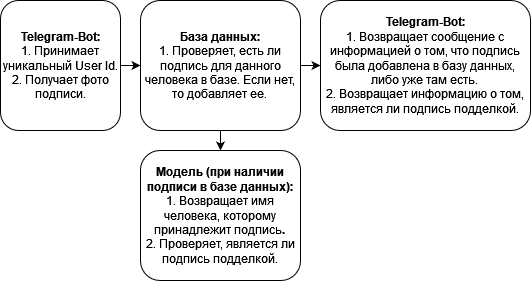

# Портал документации для проекта «Кто подписал?» в рамках зимней школы CompTech 2022

На портале представлен комплект документации проекта «Кто подписал?» для оценки работы технического писателя `Скудина Виктория Викторовна`, а именно артефакты:

* [Техническое задание](assets/srs.md);
* [Руководство пользователя](assets/user_guide.md).

README-файл расположен в корневой папке Github-репозитория [«Кто подписал?»](https://github.com/comptech-winter-school/who-signed/tree/main).

Далее приведено описание концепции Продукта.

## 1. Введение

«Кто подписал?» это проект на зимней школе CompTech 2022 для верификации рукописных подписей. 

Подпись является одним из самых старых способов подтвердить личность человека. В настоящее время многие банки и предприятия используют биометрические системы аутентификации, поэтому распознование подписей с высокой точностью является актуальной и важной задачей. 

### 1.1. Назначение документа-концепции

В этом документе определяются:

- Главная цель проекта «Кто подписал?» и идеи, которые следует учитывать при разработке;
- Задачи, которые данный проект сможет помочь решить;
- Описание возможностей и ограничений Продукта;
- Список документации.

### 1.2. Цели

К 5 февраля требуется написать Telegram-Bot, который осуществляет взаимодействие с нейронной сетью, позволяющей определить: 

- Человека, которому принадлежит подпись, с точностью,  указанной в таблице ниже:

| Precision   | Recall  | F1-score |
|:---         | ---     |      ---:|
|  0.9        | 0.9     | 0.9      |

- Является ли подпись подделкой, с точностью, указанной в таблице ниже:

| Precision   | Recall  | F1-score |
|:---         | ---     |      ---:|
|  0.9        | 0.9     | 0.9      |

## 2. Описание пользователя 

Пользователями могут быть:

- Cотрудники банков или частных компаний, которым нужно верифицировать подпись;
- Офисные сотрудники, которым труется автоматизировать документооборот.

Другие области, где возможно применение данной технологии: 

- страховое дело;
- электронную коммерцию;
- автоматизацию подписания государственных бумаг;
- контроль физического доступа;
- контроль заключенных;
- учёт рабочего времени.

## 3. Краткое описание Продукта

### 3.1. Общий вид проекта

Итоговой проект это Telegram-Bot, который использует нейронную сеть и базу данных для определения человека, которому принадлежит подпись.  

### 3.2. Характеристика возможностей 

| Возможности клиентов   | Поддерживающие функции  |
|:---                    |                     ---:|
| Загружать фото подписи | Функциональность Telegram-BOT |
| Получать имя клиента   | Функциональность Telegram-BOT |
| Получать информацию о том, является ли подпись подделкой   | Функциональность Telegram-BOT |

## 4. Функции Продукта 

- Сохранять уникальный User Id в БД;
- Получать фото подписи;
- Обрабатывать данное фото с помощью нейройнной сети;
- Определять, есть ли такая подпись в БД;
- Определять, является ли подпись на полученной фотографии подделкой.

## 5. Ограничения Продукта

- Предполагается разработка только Telegram-Bot;
- Подпись должна быть сделана на белой не помятой бумаге, фото подписи должно быть хорошего качества.

## 6. Требования к Продукту

- В качестве языка разработки должен использоваться Python;
- Для хранения информации о пользователях и их подписях должна использоваться БД SQLite3;
- Конечный пользователь должен взаимодействовать с продуктом через Telegram-Bot".

&nbsp; &nbsp; &nbsp; &nbsp; &nbsp; &nbsp; &nbsp; &nbsp; 

### 6.1. Применяемые стандарты

    - Python 3.9.9

### 6.2. Системные требования

|  Для деплоя  |  Для пользователя  |
|:---          |                ---:|
| Сервер Debian от 2-x CPU, RAM 8 GB, Space 60 GB | Наличие приложения Telegram |

Системные требования для  приложения Telegram: Система Android (версия 4.1 и выше), iOS (версия 9.0 и выше), Windows Phone, Windows, macOS или GNU/Linux.

### 6.3. Требования к производительности

Telegram-bot должен предоставить ответ, содержащий имя владельца подписи, в течение 3 секунд. 

## 7. Требования к документации

### 7.1. Файл README.md

Документ содержит информацию о команде, описывает файлы репозитория и руководство пользователя.

### 7.2. Техническое задание

Содержит детальное описание требований к продукту.

### 7.3. Руководство пользователя

Содержит инструкцию по работе с Telegram-Bot.

## 8. Глоссарий

*БД* - база данных;

*Деплой* - процесс «разворачивания» веб-сервиса, например, сайта, в рабочем окружении;

*Продукт* - готовый Telegram-Bot;

*F1-score* - среднее гармоническое precision и recall;

*Precision* - доля объектов, названных классификатором положительными и при этом действительно являющимися положительными;

*Recall* - доля объектов положительного класса из всех объектов положительного класса, которые нашел алгоритм.
