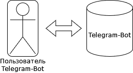

# Use cases модель

Use-cases, выявленные в процессе моделирования представлены на диаграмме. В данной системе есть только одна роль – Пользователь системы,
которая имеет полный доступ ко всей функциональности разработанной системы.

# Функциональные требования 

Мы можем сформулировать набор функциональных требований:

- FRQ1 Telegram-Bot должен предоставить возможность загрузить фото подписи
- FRQ2 Telegram-Bot должен предоставить возможность редактировать существующую запись пользователя
- FRQ3 Telegram-Bot должен предоставить возможность узнать человека, которому принадлежит подпись
- FRQ4 Telegram-Bot должен предоставить возможность проверить, является ли подпись подделкой

# Пример Use Case: Использование Telegram-Bot для проверки подписи в первый раз 

| Система | Telegram-Bot |
| :-- |--: |
| Основное действующее лицо | Пользователь приложения Telegram |
| Цель | Узнать, кому принадлежит подпись, и проверить ее на подлинность|
| Триггер | Пользователь решает воспользоваться Telegram-Bot и заходит в приложение|
| Результат | Информация о пользователе сохранена, пользователь получит информацию о фото, которое он загрузил |

## Основной поток событий

Использование Telegram-Bot для проверки подписи *в первый раз*

| № шага | Действующее лицо | Шаг | Комментарий |
| :-- | --- | --- | --: |
| 1 | Пользователь | Вводит команду `/start` | |
| 2 | Пользователь | Вводит команду `/my_sign` | |
| 3 | Система | Проверяет, есть ли данный `User Id` в базе данных | Пользователь воспользовался Telegram-Bot первый раз, поэтому запись о нём отсутствует |
| 4 | Система | Просит загрузить фото подписи | Фото должно быть хорошего качества, подпись должна быть сделана на белой не мятой бумаге |
| 5 | Пользователь | По ошибке загружает документ, а не фотографию | |
| 6 | Система | Оповещает пользователя, что данный формат не подходит, и просит пользователя загрузить фото | |
| 7 | Пользователь | Загружает фотографию подписи | |
| 8 | Система | Сохраняет данные о пользователе | |
| 9 | Система | Оповещает пользователя, что информация о нём была записана | |
| 10 | Система | Предлагает пользователю загрузить новое фото и получить о нём информацию | |
| 11 | Пользователь | Загружает новое фото своей подписи | |
| 12 | Система | Выводит на экране `User Id`, соответствуюший данной подписи | В данном случае, `User Id` пользователя |
| 13 | Система | Спрашивает, хочет ли пользователь проверить данную подпись на подлинность | |
| 14 | Пользователь | Вводит команду `yes` | |
| 15 | Система | Выводит сообщение о том, что подпись является подлинной | |
| 16 | Пользователь | Выходит из приложения | |
